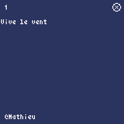
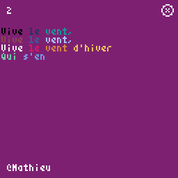
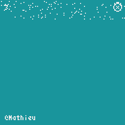

# Calendrier de l'Avent Pyxel 2025

## Défis

| # | Défi | Exemple |
| --- | --- | --- |
| 1 | Afficher "Vive le vent..." caractère par caractère. |  |
| 2 | Afficher "Vive le vent..." mot par mot en changeant de couleur à chaque fois. |  | 
| 3 | Faire neiger des pixels et les entasser en bas (effet boule de neige ?). |  |
| 4 | Afficher des lignes de 3 et les décaler chaque ligne dans un sens différent |  |
| 5 | Afficher un visage de Père Noël et zoomer dessus en le faisant tourner |  |
| 6 | Afficher un Nyan Santa |  |
| 7 | Afficher un Père Noël qui se déplace et rebondit sur les murs |  |
| 8 | Cacher un Père Noël sous un fond noir et afficher un halo révélateur au survol de la souris |  |
| 9 | Afficher l'heure comme une pebble :  |  |
| 10 |  |  |
| 11 |  |  |
| 12 |  |  |
| 13 |  |  |
| 14 |  |  |
| 15 |  |  |
| 16 |  |  |
| 17 |  |  |
| 18 |  |  |
| 19 |  |  |
| 20 |  |  |
| 21 |  |  |
| 22 |  |  |
| 23 |  |  |
| 24 |  |  |
| 25 | Afficher "Joyeux Noël !" en police outline (ex : https://www.dafont.com/fr/golden-varsity.font) avec un arc-en-ciel qui défile dans entre le corps et le contour de la police |  |
